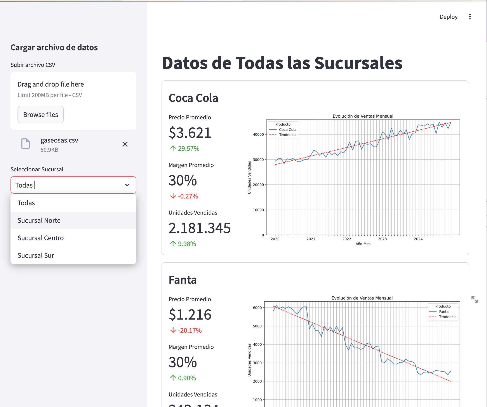

<<<<<<< HEAD
# TP7

El ejercicio de esta semana consiste en realizar una aplicación que permita explorar el efecto de la variación de los parámetros de una red neuronal en la clasificación de un conjunto de datos.

---
Se pide que realice una aplicación usando `Streamlit` que permita ingresar los parámetros de una red neuronal y visualizar el resultado de la clasificación de un conjunto de datos.

La aplicación deberá tener en el panel izquierdo la posibilidad de ingresar:
- Tasa de aprendizaje *(entre 0.0 y 1.0, comenzando en 0.1)*
- Cantidad de épocas *(entre 10 y 10,000, comenzando en 100)*
- La cantidad de neuronas en la capa oculta *(entre 1 y 100, comenzando en 5)*

Un botón que diga "Entrenar" que, al ser presionado, entrene la red neuronal con los parámetros ingresados y muestre en el panel derecho el resultado de la clasificación.

Durante el entrenamiento deberá mostrar una barra de progreso que indique el avance del entrenamiento.

Al finalizar el entrenamiento deberá mostrar un mensaje que indique que se finalizó con éxito y, debajo, el gráfico con la evolución de la función de costo en relación a las épocas.

El conjunto de datos consiste en las ventas realizadas diariamente por una empresa. La red neuronal deberá permitir estimar las ventas que se producen cada día del mes. Se puede obtener del archivo de 'ventas.csv' usando `pandas`.

El archivo 'ventas.csv' contiene dos columnas:
- día: que indica el día del mes
- ventas: que indica la cantidad de ventas realizadas ese día

La red neuronal deberá tener una capa de entrada con una neurona, una capa oculta con la cantidad de neuronas ingresadas por el usuario y una capa de salida con una neurona. Debe ser implementada con `pytorch`.

En la pantalla principal deberá mostrar un gráfico con los datos de ventas y, una vez que se entrene la red neuronal, deberá mostrar superpuesta la predicción realizada por la red neuronal.

El objetivo de este trabajo es que puedan explorar cómo varía la clasificación de un conjunto de datos en función de los parámetros de la red neuronal.

Los gráficos deberán ser realizados con `matplotlib`.

### Pantalla de muestra


---

## Cómo entregar el trabajo
1. Asegúrese de tener la última versión del repositorio.
    (Cambie a la rama main y haga un Fetch)
2. Cree una rama con su nombre.  
    (Con el nombre 'TP7 - Legajo - Nombre y Apellido')
3. Suba el trabajo a esa rama.
4. Cree un Pull Request

## Fecha de entrega
- Sabado 10 de noviembre de 2024 a las 23:59 hs

=======
# TP8: 2do Parcial

El trabajo práctico 8 actúa como segundo parcial.

El trabajo es personal y debe ser desarrollado de forma individual.
De no cumplirse este requisito, se calificará con 0 (cero) el trabajo práctico.

> Fecha de entrega:
>
> 21 de noviembre de 2024 hasta las 21:00 hs

## Enunciado

El trabajo consiste en realizar una aplicación con Streamlit que permita cargar datos de ventas y mostrarlos.

Los datos se encuentran en un archivo CSV con el siguiente formato:

```
Sucursal,Producto,Año,Mes,Unidades_vendidas,Ingreso_total,Costo_total
```

Una vez cargados los mismos, debe mostrarse para cada producto la siguiente información:
- Precio promedio (Ingreso total / Unidades vendidas)
- Margen promedio ((Ingreso total - Costo total) / Ingreso total)
- Unidades vendidas (Suma de unidades vendidas)

A su vez, se debe poder visualizar en un gráfico la evolución de la venta a lo largo de los meses.
Este gráfico debe incluir una línea de tendencia.

También debe permitir elegir si se muestran todos los datos o los de una sucursal en particular.

Por último, el programa debe ser publicado para que pueda ser accedido desde cualquier navegador.




<video width="600" controls>
  <source src="video.mp4" type="video/mp4">
  Tu navegador no soporta la etiqueta de video.
</video>

> **Nota**: 
> Recomiendo que suban el trabajo a partir de las 20:00 hs.
>>>>>>> origin/main
